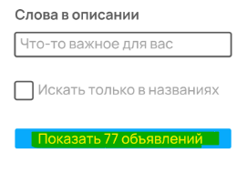

Т.к. количество объявлений в верхней части страницы и на кнопке в области фильтра не совпадает
 
 

и кнопка "Показать 77 объявлений" остается активной, можно сделать вывод, что на данной странице 
фильтр еще не применен.